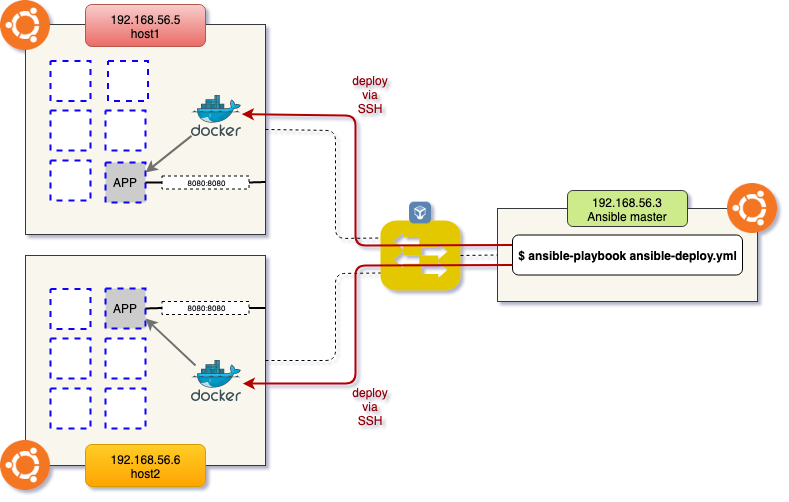

# File monitoring service

This repo was created to demonstrate a project which aims to create a service that can accept files, store them and apply compression automatically by specifying a location that is monitored for new arrivals. For this purpose a web frontend was created that lets clients update files, check event logs and request email notifications as well.

The project was set up to use a Dockerfile to define how a container image should be built, and Ansible to do the actual step of deployment to remote hosts. Below is an overview of the architecture whih was used for development and testing.



## Setup process

Ideally this is meant to be cloned to an Ansible Master node, which controls some Ansible Hosts. Since Ansible uses SSH-based communication, there is no need to set up any software in advance. To install Ansible on the master host (assuming its Ubuntu/Debian based):

```bash
$ sudo apt update
$ sudo apt upgrade -y
$ sudo apt-add-repository ppa:ansible/ansible
$ sudo apt install ansible -y
```

Then on the Ansible master node you need to set up the Slave hosts which will be configured via SSH process. To do this edit the file: `/etc/ansible/hosts` and put there:

```bash
host1 ansible_host=192.168.56.5
host2 ansible_host=192.168.56.6
```

You will also need to create an SSH key pair an and install it as trusted key to the remote machines via the below command:

```bash
$ ssh-copy-id -i path/to/ssh/id.pub 'username'@192.168.56.5
$ ssh-copy-id -i path/to/ssh/id.pub 'username'@192.168.56.6
```

Next you need to log in to each host and modify the `/etc/sudoers` file to allow the users in sudo group to execute sudo commands without requiring the password. To achieve this you should change line as follows:

```bash
>>> OLD VERSION:
%sudo ALL = (ALL:ALL) ALL
>>> NEW VERSION:
%sudo ALL = (ALL:ALL) NOPASSWD: ALL
```

Finally you are ready to test the connection by executing the below command to see if Ansible master node can access the configured slave nodes.

```bash
$ ansible ping -m all
```

This will execute a ping but not the traditional type via ICMP protocol, but a ping in Ansible style :) If all goes well you should see green output indicating success. Next you are ready to call the playbook and deploy the service to all remote hosts that you configured.

```bash
$ ansible-playbook ansible-deploy.yml
```

At the end of this process you should have a functioning service deployed on as many ansible slave nodes as you configured. To test, you should open a web browser from a machine that has IP connectivity to the ansible nodes and then visit the URL: `http://NODE_IP:8080/` to see the landing page.

## Usage

The deployed service implements a web UI through which it is possible to upload files. These files will be saved to a folder on the host machine, which is set up with the monitoring service. The service will watch for incoming files and compress them via the gzip CLI utility then store them in a different folder.

To access logs the user can navigate to `/stats` which provides a list of most recently uploaded files, as well as some statistics such as average compression ratio of all files and the name of the most highly compressed file in the database.

To request similar statistics via email, the user can navigate to `/email` where they need to enter a valid App Password for google email as well as a source and a target email address where the email will be sent. It is important to note that email sending will only work if the source account is from Gmail, and the app password was generated for this same user account through the Google Account Security page. This requirement was necessary to avoid having to hardcode a single App Password and then publishing it in a public Github repository.

## Explanation of features and implementation

Here I will briefly explain the different features and components that make up this service.

### Monitor service

This service is composed of the bash script `monitor_service.sh` which uses the inotify package from Linux. This tool lets the user set up a watcher for a directory, and will result in notifications being generated for new files created in the directory. The bash script takes the events from this and uses unix utilities to compute the size, compress, store in a separate folder, generate log messages to a file and save statistics to an SQLite3 database.

The monitored folder where files are being watched is contained withing the repository: `monitored_folder`, as well as the folder where compressed files are saved as archive.

### Web Server

This component was written in the Go language and enables the Web interface to accept file uploads, view logs and statistics and generate email reports via an SMTP connection to a google mail account. Note that an App Password is necessary for the account from which the email is sent. This eliminates the need to hard-code any real passwords into the source of project hosted on a public repository.

The simple SQLite3 database is also contained within the repository: `stats.db`. The go web server is pre-configured to use this file by default to read statistics from.

### Startup script

Since our service is hosted within one docker container, there was a need for a way to start two services in one command, hence the script was created which calls the monitor bash script and the compiled code of the go web server.

### Dockerfile

The `Dockerfile` is used to define an image that gets created on each Ansible host that gets the deployment package from the Ansible master node. It is based on the Ubuntu docker base image. In addition to pre-installed packages, some additional tools re installed, such as `[inotify-tools, golang, bc, sqlite3, git]`. After copying and compiling the source code, the final step exposes port 8080 from the container to the host machine.

### Ansible Playbook

This file (`ansible-deploy.yml`) is used to control how the software on remote Ansible hosts is installed. Before the image defined by the Dockerfile can be built, some packages are needed to be installed on each host. Most notable steps are installing the docker service and cloning of this repository where the docker file and source code hosted. The final two tasks in the playbook will build this said docker image and run it.
