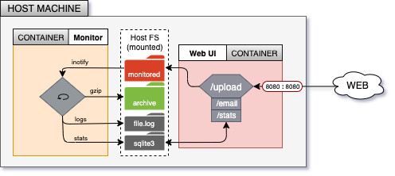

# File monitoring service

[](https://goreportcard.com/report/github.com/florianakos/file-monitor-service)

This repository hold a small project which implements a service that can monitor and compress files in a folder. For this purpose a web frontend was created that lets clients upload files , check event logs and request email notifications as well.

The project was set up in a way that it can be deployed via Ansible, which uses the Dockerfile in the repo to build the container image used to run the service on as many hosts as needed. Below is an overview of the architecture which was used for development and testing.


Youtube video screen cast with short demo of deployment and features: https://www.youtube.com/watch?v=gHDL8O-wcGQ&feature=youtu.be

## Ansible setup process

Follow these steps to install Ansible on the master host (assuming its Ubuntu/Debian based):

```bash
$ sudo apt update
$ sudo apt upgrade -y
$ sudo apt-add-repository ppa:ansible/ansible
$ sudo apt install ansible -y
```

Then on the Ansible master node you need to set up the Slave hosts which will be configured via SSH process. To do this edit the file: `/etc/ansible/hosts` and put there:

```bash
host1 ansible_host=192.168.56.5
host2 ansible_host=192.168.56.6
host3 ansible_host=...
```

You will also need to create an SSH key pair an and install it as trusted key to the remote machines via the below command:

```bash
$ ssh-copy-id -i path/to/ssh/id.pub 'username'@192.168.56.5
$ ssh-copy-id -i path/to/ssh/id.pub 'username'@192.168.56.6
```

Next you will need modify the `/etc/sudoers` file on each ansible host, to allow members of sudo group to execute sudo commands without typing in the password. To achieve this you should change line as follows:

```bash
>>> LOOK FOR LINE:
%sudo ALL = (ALL:ALL) ALL
>>> CHANE TO:
%sudo ALL = (ALL:ALL) NOPASSWD: ALL
```

Finally you are ready to test the connection by executing the below command to see if Ansible master node can reach the configured slave nodes.

```bash
$ ansible ping -m all
```

This will execute a ping but not the traditional type via ICMP protocol, but a ping in Ansible style :) If all goes well you should see green output indicating success. Next you are ready to call the playbook and deploy the service to all remote hosts that you configured.

```bash
$ ansible-playbook ansible-deploy.yml
```

At the end of this process you should have a functioning service deployed on as many Ansible slave nodes as you configured in the `/etc/ansible/hosts` file. To test the service, you should open a web browser from a machine that has IP connectivity to any of the Ansible hosts, and then visit the URL: `http://ansible_host_ip:8080/` to see the landing page of the service.

## How To Use

The service implements a web interface, through which it is possible to upload files. These files will be saved to a folder on the host machine, which is set up with the monitoring service. The service will watch for incoming files and compress them via the gzip CLI utility then store them in a different folder.

To access logs the user can navigate to `/stats` which provides a list of most recently uploaded files, as well as some statistics such as average compression ratio of all files and the name of the most highly compressed file in the database.

To request similar statistics via email, the user can navigate to `/email` where they need to enter a valid App Password for google email as well as a source and a target email address where the email will be sent. It is important to note that email sending will only work if the source account is from Gmail, and the app password was generated for this same user account through the Google Account Security page. This requirement was necessary to avoid having to hardcode a single App Password and then publishing it in a public Github repository.

## Explanation of components and features

Here I will briefly explain the different features and components that make up this service.


### Monitor service

This service is composed of the bash script `monitor_service.sh` which uses the `inotify` package from Linux. This tool lets the user set up a watch function for a directory, and will report any new files created in the directory. The bash script takes the filenames and uses other CLI utilities to compute the size, compress, store it in a separate folder, generate log messages to a file and also to save statistics to a local SQLite3 database.

### Web Server

This component was written in the Go and implements the Web interface that can accept uploads, display logs and statistics and generate email reports via an SMTP connection to a google mail account. Note that in order for the email notification to succeed, an App Password need to be generated via the Google Security dashboard, for the email which is used to send it. This way there is no need to hardcode any password in the source-code of this repository.

### Docker

A `Dockerfile` is used to define an container image that gets created on each Ansible host during deployment. The image is based on the Ubuntu base image and includes some additional packages such as `[inotify-tools, golang, bc, sqlite3, git]`. After copying and compiling the source code of the service, port 8080 of the container is exposed to accept external connections from the host machine where the container will live.

### Ansible Playbook

The file `ansible-deploy.yml` is used to define how the docker image is built and deployed on the Ansible remote hosts. Before the docker image can be built, some packages are installed on each host as a prerequisite. The final two tasks in the playbook achieve the actual build and run of the container.

## Version 2.0

Some improvements have been made to the first version of this application when it comes to Docker and Ansible. In order to better align with the `microservice` style architecture, the Dockerfile was split into 2 parts:

* `Web-service`: upload, email, statistics
* `Monitor-service`: inotify

To enable the interaction between containers, some folders from the host file system have been mounted to both containers. See the respective Dockerfiles for details.

When it comes to Ansible, now the playbook does not have to specify the build and run phases, but rather uses the `docker_compose` module to start the service in one run with the docker-compose.yml file included in the project.


